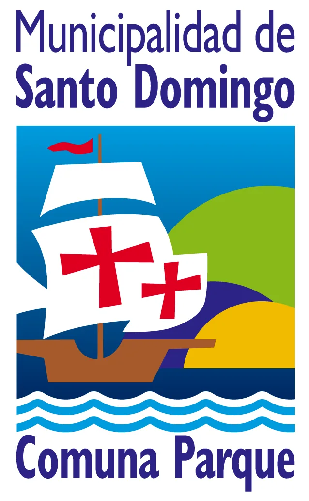
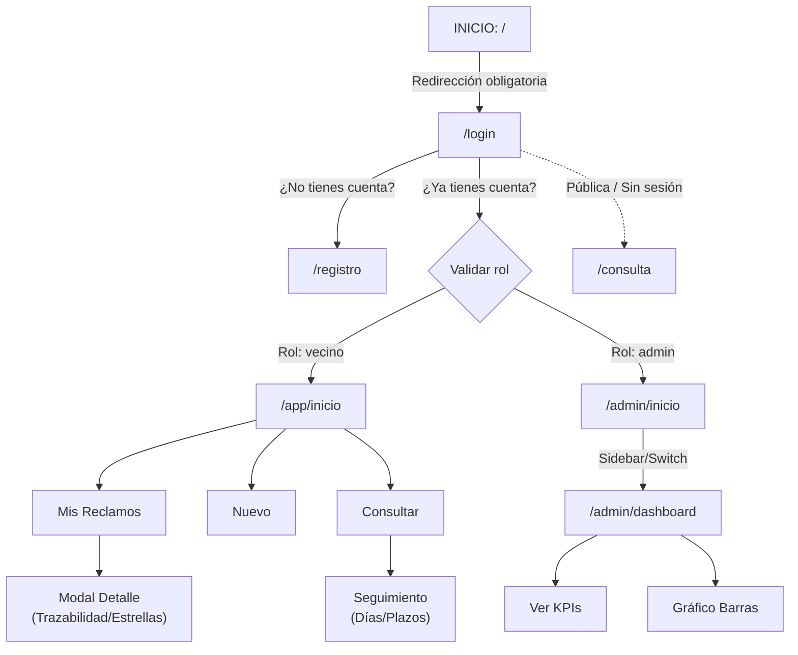

# MiSantoDomingo

<div align="center">
  
  <p><b>Plataforma Municipal de Atención y Seguimiento de Reclamos Vecinales</b></p>
</div>

---

## 1. Identificacion de los integrantes del equipo y sus roles

**Sebastian Garay** - Arquitectura de Software, Desarrollo Frontend y Control de Calidad

**Benjamín Lazcano** - Líder de Requerimientos, Investigación y Documentación UX

**Vicente Olguin** - Diseño UI/UX y Prototipado Manual Figma (Versión Escritorio / Web)

**Ignacio Maureira** - Diseño UI/UX y Prototipado Manual Figma (Versión Móvil)

---

## 2. Distribucion de responsabilidades

### 2.1. Sebastián Garay

Responsabilidad: Arquitectura frontend, componentes estructurales, enrutamiento y desarrollo en Ionic con React (EP 1.5 y EP 1.6).

Entregables:Configuración modular del proyecto (`pages/`, `components/`, `routes/`, `services/`, `types/`, `contexts/`, `hooks/`); enrutamiento con React Router y rutas protegidas por rol con guardias; desarrollo de los servicios mock asíncronos (`report.service.ts` y `auth.service.ts`) con contratos TypeScript; implementación de las 6 vistas funcionales responsivas; sincronización de layouts (sidebar colapsable en PC y barra de navegación inferior en celular); guardia de cambios no guardados y alertas de sesión.

### 2.2. Benjamin Lazcano

Responsabilidad: Requerimientos (EP 1.1), investigación de usuarios (EP 1.2), arquitectura de información (EP 1.4) y README.md (3.1).

Entregables: Matriz de 11 Requerimientos Funcionales (sin login/registro) y 6 No Funcionales; justificación demográfica del problema basada en datos del Censo INE 2017 y 2024 de Santo Domingo; caracterización de 2 proto-personas con supuestos razonados; redacción de los 4 Task Flows y justificación técnica de arquitectura.

### 2.3. Vicente Olguin

Responsabilidad: Prototipado manual en Figma del flujo de gestión del funcionario, versión web (EP 1.3).

Entregables: Diseño manual en Figma de las vistas de escritorio: pantalla de acceso/login; bandeja general tabular de reclamos con filtros combinables por unidad y categoría (RF-06); modal de detalle con flujo de derivación a unidades técnicas (RF-07) y cierre formal con respuesta oficial (RF-08); estados de éxito (SUCCESS) y error; dashboard de indicadores KPI con gráfico de barras comparativo (RF-10).

### 2.4. Ignacio Maureira

Responsabilidad: Prototipado manual en Figma del flujo completo del vecino, versión móvil (EP 1.3).

Entregables: Diseño manual en Figma de la experiencia móvil ciudadana: pantallas de bienvenida, login y registro con validaciones visuales; portal de inicio del vecino con listado "Mis Reclamos"; flujo de ingreso de reclamo con categorías, descripción con contador de caracteres, dirección y adjunto de fotografía (RF-01) con confirmación de folio único (RF-02); flujo de consulta de estado por número de folio sin sesión (RF-03); cálculo visual de plazo legal de 20 días (RF-04); módulo de calificación ciudadana con escala de 5 estrellas (RF-09); barra de navegación inferior móvil.

---

## 3. Descripción general del sistema y problema que aborda

### 3.1. Problema o necesidad que aborda

Tiempos de respuesta prolongados o falta de soluciones efectivas a los reclamos y
solicitudes que los ciudadanos ingresan al municipio, generando frustración.

### 3.2. Justificacion del problema y caracterizacion de los usuarios objetivos

La propuesta nace a partir del análisis del reporte comunal de Santo Domingo (Censo de Población y Vivienda 2017 y 2024, INE). Al comparar ambos períodos se observa que el grupo etario de 45 a 64 años es el más numeroso de la comuna (26,6% de la población comunal en 2024), y que el grupo de 65 años o más presenta un crecimiento sostenido entre 2017 y 2024 (de 1.457 a 2.474 personas, pasando de 13,4% a 18,8% de la población comunal). Este comportamiento demográfico es consistente con un proceso de envejecimiento poblacional que ya supera el promedio regional (16,6%) y nacional (14%) en ese tramo etario.

Este contexto es relevante porque los canales actuales de gestión de reclamos municipales (atención presencial y telefónica en la Oficina de Informaciones, Reclamos y Sugerencias, OIRS) no entregan trazabilidad al vecino: una vez ingresado un reclamo, la persona no tiene forma autónoma de saber en qué estado se encuentra ni qué unidad lo está gestionando. Cuando el reclamo pasa por más de una unidad municipal (según lo descrito en el Art. 42 del manual de ordenanzas), esta falta de visibilidad se agrava tanto para el vecino como para el propio funcionario, generando reclamos duplicados, pérdida de antecedentes y desgaste en la atención.

Si este problema no se aborda, las consecuencias esperables son: abandono del proceso de reclamo por parte del vecino (especialmente si los pasos son largos o poco claros), sobrecarga de los canales presenciales y telefónicos, pérdida de trazabilidad entre unidades municipales, y baja capacidad de la municipalidad para priorizar y medir su gestión de reclamos mediante indicadores.

Dado que el grupo etario predominante y de mayor crecimiento en la comuna corresponde a adultos medios y adultos mayores, la solución debe diseñarse pensando prioritariamente en este perfil de usuario —y no en un usuario joven "digital nativo"— sin dejar de lado al funcionario municipal que gestiona la contraparte del proceso.

Fuentes: https://www.bcn.cl/siit/reportescomunales/comunas_v.html?anno=2026&idcom=5606

### 3.3. Objetivos del proyecto

- Disponer de un canal ciudadano digital accesbile para ingresar reclamos en menos de 3 mnutos con obtención inmediata de comprobante único de folio.
- Garantizar la trazabilidad completa del ciclo de vida del reclamo tanto para el vecino como para los funcionarios municipales.
- Proporcionar al municipio una herramienta administrativa para medir tiempos de respuesta frente al plazo legal de 20 días y priorizar la gestión mediante indicadores KPI.

---

## 4. Caracterización de usuarios y proto-personas

### 4.1. Grupos de usuarios y roles del sistema

El sistema considera dos grupos de usuarios, correspondientes a los dos roles definidos para la aplicación:

-Vecino/Vecina (adulto medio – adulto mayor)

-Funcionario municipal (encargado de gestión de reclamos, OIRS)

### 4.1.A. Vecino/Vecina

Características generales: de acuerdo con los datos censales de la comuna, se estima para este grupo un nivel de experiencia tecnológica medio a bajo. Gran parte de las personas de este tramo etario utiliza aplicaciones básicas (por ejemplo, WhatsApp), pero no está necesariamente familiarizada con formularios extensos, procesos con múltiples pasos, o interfaces con alta densidad de información.

Necesidad principal: de carácter informativa — saber "qué está pasando" con su reclamo. Si el procedimiento resulta tedioso o poco claro, el riesgo esperado es el abandono del proceso.

Contexto de uso: cualquier lugar con conexión a internet, principalmente a través del celular, en momentos no planificados (por ejemplo, al recordar que tiene un reclamo pendiente).

Objetivos/tareas dentro del sistema: ingresar un reclamo, consultar su estado, y ser notificado ante cambios, sin depender de llamadas o visitas presenciales.

Accesibilidad, seguridad y privacidad: se requiere texto legible y lenguaje simple (RNF-01), y dado que el sistema recopila datos personales, estos deben ser protegidos adecuadamente (RNF-03).

### 4.1.B. Funcionario municipal

Características generales: se asume un nivel de experiencia tecnológica media-alta, con uso diario de herramientas de oficina como correo electrónico y planillas.

Necesidad principal: revisar y priorizar un volumen alto de reclamos de forma simultánea, sin perder trazabilidad cuando un reclamo es derivado entre distintas unidades (Art. 42 del manual de ordenanzas).

Contexto de uso: jornada laboral, en oficina municipal, principalmente desde computador de escritorio.

Objetivos/tareas dentro del sistema: visualizar reclamos pendientes, filtrar por plazo vencido o próximo a vencer, derivar, responder y cerrar reclamos.

Accesibilidad, seguridad y privacidad: al tratarse de un rol con permisos de gestión y acceso a datos de vecinos, sus acciones (derivar, cerrar, responder) deben quedar protegidas mediante autenticación con verificación de rol (RNF-03), impidiendo que un vecino acceda a estas funciones.

### 4.2. Roles considerados en el sistema

Vecino/Vecina Usuario que ingresa y hace seguimiento a sus reclamos.

Funcionario municipal Usuario que gestiona, deriva y responde los reclamos ingresados.

### 4.3. Proto-personas

Nota: los perfiles a continuación son proto-personas construidas mediante investigación documental (Censo de Población y Vivienda 2017–2024, INE, comuna de Santo Domingo) y supuestos razonados por el equipo. No corresponden a resultados obtenidos de usuarios reales, sino a una caracterización preliminar que será validada en etapas posteriores del proyecto.

### 4.3.A. Proto-persona 1 — Vecina

Rol: Vecina

Perfil: Maria (nombre ficticio), 58 años, dueña de casa experiencia tegnologica media-baja.

Necesidad principal: Saber con certeza y claridad qué está pasando con su solicitud sin tener que viajar al municipio ni esperar llamadas telefónicas.

Objetivo de uso: Ingresar el reclamo una vez y consultarlo sin tener que llamar o ir presencialmente.

Frustracion: Llamar a la municipalidad y que no le sepan informar en qué estado está su solicitud o enterarse semanas después de que el reclamo fue archivado sin respuesta.

Funcionalidades que utilizaría:Ingresar reclamo (RF-01), seguimiento por folio sin cuenta (RF-03), ver días restantes (RF-04) y calificar la atención recibida (RF-09).

Dispositivo/contexto : Celular Android de gama media, conexión móvil estándar/intermitente, uso en momentos domésticos no planificados.

### 4.3.B. Proto-persona 2 — Funcionario municipal

Rol:Funcionario municipal

Perfil: Felipe (nombre ficticio), 32 años, encargado de OIRS, gestiona decenas de reclamos diarios, experiencia tecnológica media-alta

Necesidad principal: Priorizar un volumen alto de solicitudes y derivar casos entre unidades municipales sin perder el historial.

Objetivo de uso: Revisar la bandeja central, filtrar por plazo legal próximo a vencer, derivar formalmente a cuadrillas técnicas y responder con cierre formal.

Frustración: Reclamos duplicados o solicitudes traspapeladas entre direcciones distintas por falta de registro unificado.

Funcionalidades que usaría: Tabla de gestión con filtros combinados (RF-06), derivación con observación obligatoria (RF-07), cierre formal con respuesta visible al vecino (RF-08) y panel de indicadores KPI (RF-10).

Dispositivo/contexto: Computador de escritorio, oficina municipal.

### 4.4. Supuestos utilizados para construir los perfiles

-Se asume que María no ha usado antes una aplicación municipal digital, por lo que su primera experiencia debe ser autoexplicativa.

-Se asume que María dispone de un celular Android con conexión intermitente, pero no necesariamente de computador en casa.

-Se asume que Felipe trabaja con computador de escritorio fijo en la oficina municipal y no gestiona reclamos desde su celular.

-Se asume que Felipe ya está familiarizado con sistemas de gestión documental municipal (Art. 42 del manual), por lo que su curva de aprendizaje de la aplicación es menor que la de un vecino.

-Se asume que ambos roles priorizan la claridad del estado del reclamo por sobre funciones avanzadas o de personalización.

Fuentes: https://www.bcn.cl/siit/reportescomunales/comunas_v.html?anno=2026&idcom=5606

---

## 5. Requerimientos del sistema

El ítem 1.1 explícitamente dice:”Estas funcionalidades están fuera de inicio se sesión o registrarse ya que deben estar inmersas en la propuesta.” Por lo que se asume todo tipo de requerimiento de agregar usuario, ingresar usuario, ingreso de datos etc.

Considerando que un proyecto tiene más requerimientos funcionales, se enfatiza en la principal problemática.

### 5.1. Requerimientos funcionales (RF)

**RF-01 Ingreso de Reclamo**: El sistema permitira al vecino ingresar un reclamo seleccionando una categoría de lista cerrada, redactando una descripción (máx. 500 caracteres), indicando la ubicación física y adjuntando opcionalmente una fotografía de respaldo.

**RF-02 Generación de Folio Único** : El sistema generara automáticamente tras el envío un identificador alfanumérico único e irrepetible (formato #SD-2026-XXXXXX), mostrándolo de inmediato en una pantalla de confirmación.

**RF-03 Consulta Pública por Folio**: El sistema deberá permitir al vecino consultar el estado actualizado, ubicación y unidad asignada a un reclamo ingresando únicamente su número de folio, sin exigir inicio de sesión previo.

**RF-04 Cálculo de Plazo Legal**: El sistema deberá calcular de forma automática desde la fecha de ingreso los días restantes del plazo legal de 20 días corridos de respuesta municipal, alertando visualmente cuando el plazo se encuentra vencido.

**RF-05 Trazabilidad Histórica**: El sistema deberá mantener un registro cronológico de cada avance, cambio de estado y derivación de la solicitud, disponible tanto en la ficha del vecino como en el panel administrativo.

**RF-06 Bandeja Filtrable de Reclamos** : El sistema deberá permitir al funcionario listar todas las solicitudes y aplicar filtros combinables por categoría, unidad responsable asignada y búsqueda libre de texto o folio.

**RF-07 Derivación entre Unidades** : El sistema deberá permitir al funcionario derivar un reclamo hacia otra unidad municipal técnica (Obras, Salud, Educación, Desarrollo comunitario), exigiendo registrar un motivo u observación de traspaso.

**RF-08 Cierre Formal con Respuesta**: El sistema deberá permitir al funcionario cerrar un reclamo ingresando obligatoriamente una respuesta formal descriptiva, cambiando el estado a "Resuelto" y dejándola visible para el vecino.

**RF-09 Calificación Ciudadana Única** : El sistema deberá permitir al vecino evaluar la solución municipal en una escala de 1 a 5 estrellas, bloqueando la votación tras el primer envío para asegurar que se vote una única vez por reclamo resuelto.

**RF-10 Dashboard de Indicadores KPI** : El sistema deberá desplegar un panel de métricas en tiempo real con el volumen total de solicitudes, el tiempo promedio de respuesta comunal, el recuento de casos vencidos y un gráfico de barras por categoría con filtro por período.

**RF-11 Reportes Periódicos de Gestión**: El sistema deberá permitir consolidar el porcentaje de resolución de reclamos dentro del plazo legal y desglosar el volumen mensual para auditoría municipal.

### 5.2. Requerimientos no funcionales (RNF)

**RNF-01 (Usabilidad)**: La interfaz móvil debe diseñarse con lenguaje simple, tipografía mínima de 14–16px y alto contraste, permitiendo completar un reclamo en menos de 3 minutos por usuarios de tercera edad.

**RNF-02 (Accesibilidad Táctil)**: Todas las áreas de interacción táctil principales (botones de acción y pestañas de navegación) deben tener un tamaño objetivo mínimo de 44x44 px.

**RNF-03 (Seguridad)**: El sistema deberá restringir el acceso a las funciones según el rol del usuario, permitiendo que cada tipo de usuario acceda únicamente a las funcionalidades que le correspondan.

**RNF-04 (Integridad y Prevención)**: El formulario de ingreso de reclamos debe contar con una guardia preventiva contra pérdida de datos (Unsaved Changes Guard), alertando al usuario si intenta cambiar de sección con cambios sin guardar.

**RNF-05 (Trazabilidad)**: Toda actualización de estado debe registrar fecha, hora y responsable de la acción de forma inmutable en el historial.

**RNF-06 (Adaptabilidad Responsiva)**: La aplicación debe ofrecer una experiencia adaptada según el dispositivo: barra de navegación inferior en dispositivos móviles y menú lateral colapsable en escritorio.

---

## 6. Arquitectura de navegación y experiencia de usuario

### 6.1. Mapa General de Rutas



### 6.2. Jerarquía de Vistas y Diferenciación por Rol

1. Rutas Públicas:

- /login: Acceso unificado con detección automática de rol.
- /registro: Creación de cuenta vecinal con validación individual de campos.
- /consulta: Búsqueda ciudadana por número de folio alfanumérico.

2. Rutas Privadas del Vecino (Móvil-First):

- /app/inicio: Vista principal del vecino protegida por rol. Integra dinámicamente el listado de Mis Reclamos, el formulario de Nuevo Reclamo y la Consulta integrada por folio.

3. Rutas Privadas del Funcionario Municipal (Desktop-First):

- /admin/inicio: Bandeja central tabular de solicitudes con filtros y acciones de derivación y cierre formal.
- /admin/dashboard: Monitor de indicadores de gestión comunal y métricas de rendimiento.

### 6.3. Principales Flujos de Tareas (Task Flows)

1. Task Flow 1 — Vecino reporta problema comunal:
   Login como vecina ->
   portal /app/inicio ->
   pulsa pestaña "Nuevo" ->
   completa categoría, descripción, dirección y foto ->
   presiona "Enviar reclamo" ->
   pantalla de confirmación con folio #SD-2026-XXXXXX ->
   retorno al listado donde el reclamo aparece inmediatamente como EN PROCESO.

2. Task Flow 2 — Consulta anónima ciudadana:
   Abre /consulta ->
   tipea folio ->
   el sistema despliega estado, días restantes del plazo de 20 días y línea de tiempo ->
   si está resuelto, lee la solución formal y evalúa con 1 a 5 estrellas doradas.

3. Task Flow 3 — Funcionario deriva y cierra reclamos:
   Login administrativo ->
   bandeja /admin/inicio ->
   filtra por unidad o categoría ->
   abre ficha de detalle ->
   selecciona "Derivar" (elige unidad destino y redacta observación) o "Cerrar" (redacta solución técnica oficial) ->
   confirmación SUCCESS ->
   actualización reactiva de la tabla.

4. Task Flow 4 — Monitoreo de indicadores OIRS:
   Desde la barra lateral hace clic en "Métricas de Gestión" ->
   visualiza KPIs de volumen y plazos vencidos ->
   filtra por período temporal ->
   analiza gráfico de barras.

### 6.4. Puntos Críticos de Interacción y Justificación Técnica

- Guardia de Datos no Guardados (Unsaved Changes Guard): Si el vecino está redactando un reclamo y pulsa accidentalmente otra pestaña de la barra inferior, el sistema intercepta el cambio y abre una alerta nativa (IonAlert) consultando si desea descartar o continuar editando, mitigando la pérdida accidental de datos.
- Confirmación Universal de Salida: Toda acción de "Cerrar Sesión" exige confirmación previa mediante modal destructivo, impidiendo salidas involuntarias de la sesión.

- Bloqueo de Votación Única: Tras emitir la calificación de estrellas, los controles se bloquean permanentemente mostrando el puntaje asignado, satisfaciendo la condición de voto único de RF-09.

- Coherencia entre Dispositivos: En pantallas móviles se utiliza una barra de pestañas fija (IonTabBar) al alcance del pulgar, mientras que en pantallas de escritorio se activa una barra lateral colapsable (AdminSidebar y VecinoSidebar) que permite maximizar el área de trabajo de las tablas y gráficos mediante botones de repliegue.

---

## 7. Prototipos UI/UX en Figma

1. Prototipo Versión Web / Escritorio (Vicente Olguín):
   https://www.figma.com/design/g226BWBCK7VZ2fzl9aj8at/Sin-título?node-id=0-1&t=OWk7vIgmDlFjNYgl-1

2. Prototipo Versión Móvil (Ignacio Maureira):
   https://www.figma.com/design/APracKRLzJMMzqzsLFHSXx/Sin-t%C3%ADtulo?node-id=0-1&t=x8JV6gNCCvaOFn40-1

---

## 8. Tecnologías y herramientas utilizadas

- Framework UI: Ionic 8 (@ionic/react, @ionic/react-router)
- Librería Base: React 18 con TypeScript
- Enrutamiento: React Router v5 (react-router-dom 5.3.4) con Switch, Route y Redirect
- Herramienta de Compilación: Vite 5 (@vitejs/plugin-react)
- Iconografía: Ionicons 7
- Almacenamiento y Estado: Context API de React con persistencia sincronizada en localStorage
- Control de Versiones: Git y GitHub

---

## 9. Estructura del Proyecto

```
MiSantoDomingo/
├── public/
│   ├── favicon.png
│   ├── logo-santodomingo.png       # Emblema oficial municipal
│   └── manifest.json
├── src/
│   ├── components/                 # Componentes reutilizables
│   │   ├── AdminSidebar.tsx        # Barra lateral colapsable del funcionario (Web)
│   │   ├── VecinoSidebar.tsx       # Barra lateral colapsable del vecino (Web)
│   │   └── ProtectedRoute.tsx      # Guardia de autenticación y control de rol
│   ├── contexts/
│   │   └── AuthContext.tsx         # Estado global de sesión con persistencia F5
│   ├── hooks/
│   │   └── useAuth.ts              # Hook personalizado para consumo de sesión
│   ├── pages/                      # Pantallas de la aplicación
│   │   ├── auth/
│   │   │   ├── LoginPage.tsx       # Inicio de sesión institucional
│   │   │   └── RegistroPage.tsx    # Registro ciudadano con validaciones
│   │   ├── public/
│   │   │   └── ConsultaPublicaPage.tsx  # Búsqueda por folio sin sesión
│   │   ├── vecino/
│   │   │   └── VecinoHomePage.tsx  # Portal del vecino (Mis Reclamos / Nuevo)
│   │   ├── admin/
│   │   │   ├── AdminHomePage.tsx   # Gestión OIRS tabular y derivación
│   │   │   └── Dashboard.tsx       # Monitor de métricas comunales y KPIs
│   │   └── NotFoundPage.tsx        # Página de error 404
│   ├── routes/
│   │   └── AppRoutes.tsx           # Mapa central de rutas e IonRouterOutlet
│   ├── services/                   # Servicios mock asíncronos (Promise)
│   │   ├── auth.service.ts         # Mock de cuentas de prueba
│   │   └── report.service.ts       # Mock de reclamos, cálculo legal y folios
│   ├── theme/
│   │   └── variables.css           # Paleta Santo Domingo (Azul, Verde, Amarillo)
│   ├── types/
│   │   └── index.ts                # Contratos de datos del dominio
│   ├── App.tsx                     # Raíz: IonApp > IonReactRouter > AuthProvider
│   └── main.tsx                    # Entrada React 18
├── index.html                      # Entry point con viewport nativo y favicon
├── package.json
└── README.md
```

---

## 10. Instrucciones de instalación y configuración

### 10.1. Requisitos previos

- Node.js: Versión 18.x o superior recomendada.
- npm: Versión 9.x o superior.
- Git: Instalado en el sistema operativo.

### 10.2. Pasos de instalación

1. Clonar el repositorio:

   ```bash
   git clone https://github.com/sebagarayn/MiSantoDomingo.git
   ```

2. Entrar al directorio del proyecto:

   ```bash
   cd MiSantoDomingo
   ```

3. Cambiar a la rama frontend:

   ```bash
   git checkout frontend
   ```

4. Instalar dependencias:

   ```bash
   npm install
   ```

---

## 11. Instrucciones de ejecución y uso

### 11.1. Levantar el servidor del desarrollo

```bash
npm run dev
```

Una vez iniciado, abre el navegador en la URL indicada por la terminal (por defecto http://localhost:5173).

### 11.2. Cuentas de acceso de prueba (para la demostración)

Para evaluar las rutas protegidas y la diferenciación por roles, utiliza las siguientes credenciales:

1. **Vecina (Ciudadano)**

- Correo Electrónico: vecino@correo.cl
- Contraseña: Cualquier clave (ej: 123456)

(Esto lleva a /app/inicio)

2. **Funcionario OIRS (Admin)**

- Correo Electrónico: admin@correo.cl
- Contraseña: Cualquier clave (ej: 123456)

(Esto lleva a /admin/inicio)

3. **Público (Sin Cuenta)**

No usa credenciales, es la opción de consultar sin cuenta, lleva directamente a /consulta.

### 11.3. Para comprobar la compilación

```bash
npm run build
```
